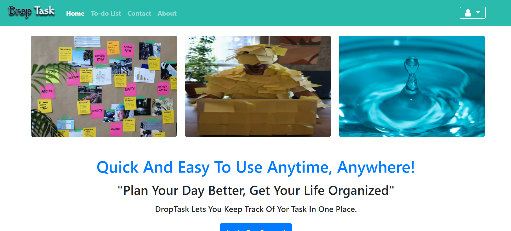
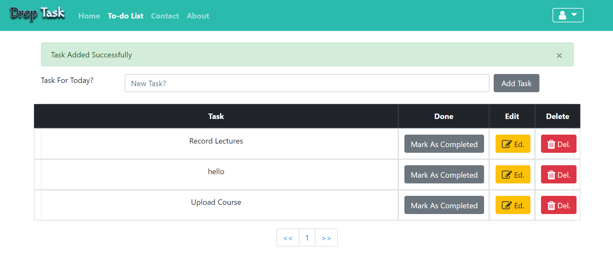
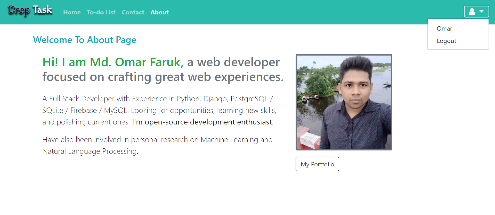

# DropTask
*Quick And Easy To Use Anytime, Anywhere! "Plan Your Day Better, Get Your Life Organized".*

*DropTask Lets You Keep Track Of Yor Task In One Place. You can add your daily task, can completed by clicking, can update a task and also can delete a task.*

# Features
* Add task
* Complete task
* Edit task
* Delete task
* Contact
* About
* etc,....

# Tools
## Front-end Part
* HTML
* CSS
* Bootstrap
## Back-end
* Django
* SQLite 3

# Screenshots of the Project

  
  
  

**Copyright (c)** 2020-3020 Md. Omar Faruk

## Go Through This Site Then You Will Know About This Site Properly.
